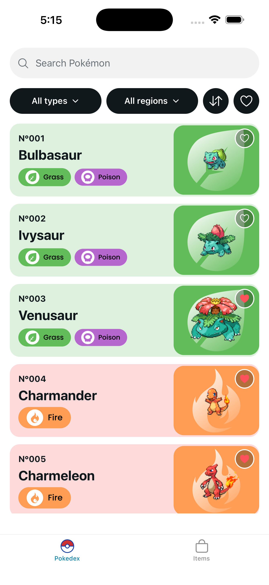
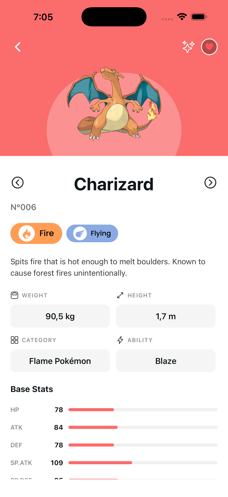
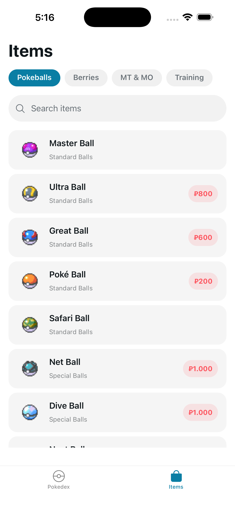
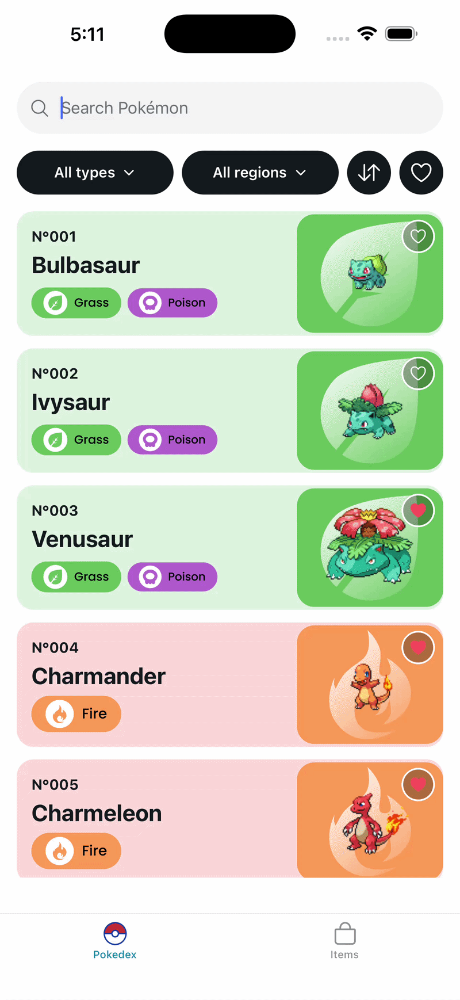
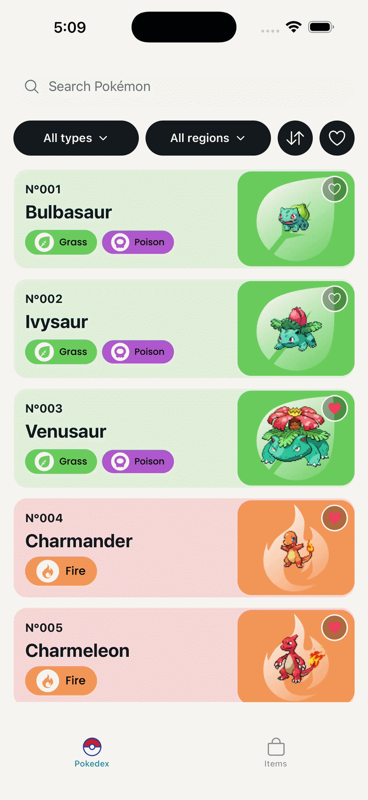
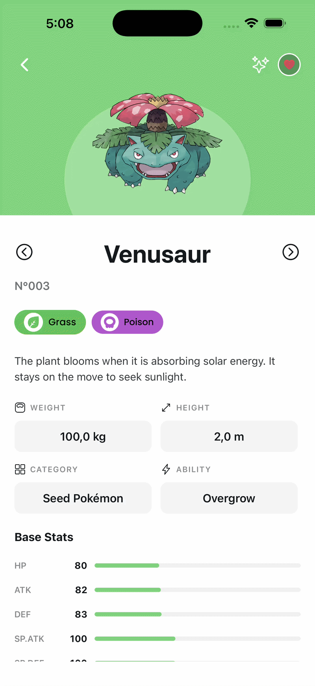

# Pokédex App

A full-featured Pokédex mobile app built with React Native and Expo, consuming the [PokéAPI GraphQL endpoint](https://beta.pokeapi.co/graphql/v1beta).

---

## Screenshots

<p style="text-align: center">
  
  
  
</p>

---

## Demo

<table>
  <tr>
    <td style="text-align: center"><b>Search</b></td>
    <td style="text-align: center"><b>Filter & navigate</b></td>
  </tr>
  <tr>
    <td></td>
    <td></td>
  </tr>
  <tr>
    <td style="text-align: center"><b>Infinite scroll</b></td>
    <td style="text-align: center"><b>Detail navigation</b></td>
  </tr>
  <tr>
    <td></td>
    <td></td>
  </tr>
</table>

---

## Features

- **Pokédex** — Browse all 1025 Pokémon with infinite scroll, search, type filter, region filter, and sort options
- **Favorites** — Mark Pokémon as favorites, persisted locally with Zustand + AsyncStorage
- **Pokémon detail** — Type-colored header, official artwork, shiny toggle, base stats with animated bars, evolution chain, and Pokédex entry
- **Items** — Browse items by category (Pokéballs, Berries, TMs, Training), with server-side search
- **Item detail** — Sprite, buy/sell price, flavor text, and effect description

## Tech Stack

| Area | Choice |
|---|---|
| Framework | [Expo](https://expo.dev) (managed workflow) |
| Routing | [Expo Router](https://expo.github.io/router/) (file-based) |
| Data fetching | [TanStack React Query v5](https://tanstack.com/query) with infinite scroll |
| API | [PokéAPI GraphQL](https://beta.pokeapi.co/graphql/v1beta) |
| State management | [Zustand](https://zustand-demo.pmnd.rs/) with AsyncStorage persistence |
| Animations | [React Native Reanimated v3](https://docs.swmansion.com/react-native-reanimated/) |
| Internationalisation | [i18next](https://www.i18next.com/) + react-i18next |
| Component architecture | Atomic Design (atoms → molecules → organisms) |
| Testing | Jest + React Native Testing Library |

## Getting Started

```bash
cp .env.example .env
npm install
npx expo start
```

Then open the app in an iOS simulator, Android emulator, or on device via Expo Go.

## Internationalisation

All UI strings live in [`locales/en.json`](locales/en.json), loaded via a dedicated i18next instance (`i18n/index.ts`). Adding a new language requires only a new locale file and an extra entry in the `resources` map — no component changes needed.

## Running Tests

```bash
npm test
```

The test suite covers:
- **Normalizers** — data mapping, fallbacks, and markup stripping for both Pokémon and items
- **Custom hooks** — `useDebounce`, `useItems` (tab/search state), `usePokemonList`, `useItemsList`
- **Components** — `Typography` variants, `TabBar` interaction and accessibility state

## Project Structure

```
app/              # Expo Router screens (file-based routing)
  (tabs)/         # Bottom tab screens
  pokemon/[id]    # Pokémon detail
  items/[id]      # Item detail
components/
  atoms/          # Base building blocks (Typography, TextBox, ...)
  molecules/      # Composed components (PokemonCard, TabBar, ...)
  organisms/      # Feature-level components (ItemList, StatBar, ...)
api/              # GraphQL queries, fetchers, and normalizers
hooks/            # Custom hooks (usePokedex, useItems, useDebounce, ...)
store/            # Zustand stores
constants/        # Types, theme, and filter options
```
